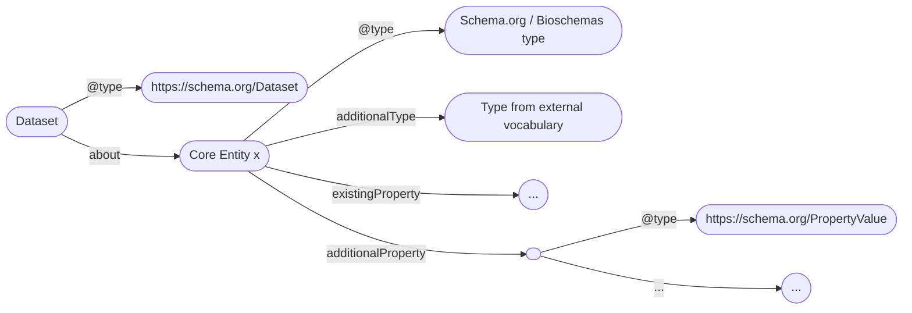
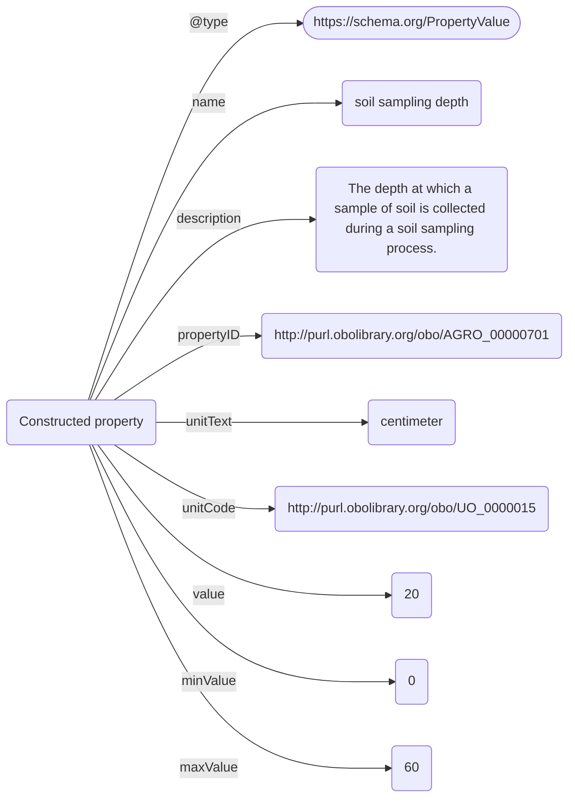

Draft version; 12.08.2025
# Overview
Agrischemas is a framework building on Schema.org and [Bioschemas](https://bioschemas.org/) to add agricultural related information to [Dataset](https://schema.org/Dataset) metadata with a focus on increasing its findability. It uses existing [types](https://bioschemas.org/types/), [properties](https://schema.org/Property) and [profiles](https://bioschemas.org/profiles/) and recommends semantic concepts to achieve interoperability.
One of Agrischemas' possible use-cases is the harmonization of metadata of different Research Data Infrastructures (RDIs) participating in the [FAIRagro consortium](https://fairagro.net/) to power its central [FAIRagro Search Hub](https://search-hub.fairagro.net/).
This tutorial explains the concepts of the Agrischemas framework, recommended properties and their semantic concepts and basic implementation guidance for RDIs that want to adopt it.

```
To-Do: 
- What are the benefits of adopting Agrischemas?
	- Showcase FAIRagro Search Hub queries
	- Showcase mapping/interoperability possibilities
	- ?
```


# Core entities and their Schema.org/Bioschemas types
Agrischemas uses a set of existing Schema.org / Bioschemas types to represent its core entities:
	- Crop: A cultivated plant that is somehow related to a dataset.; uses [BioSample](https://bioschemas.org/BioSample).
	- Soil:  A soil sample that is somehow related to a dataset.; uses [Sample](https://bioschemas.org/Sample).
	- Plot:  An area of land, somehow related to a dataset, with a particular ownership, land use, or other characteristic.; uses [Place](https://schema.org/Place).
	- Sensor:  A device, somehow related to a dataset, that observes and measures a physical property of a natural phenomenon or man-made process and converts that measurement into a signal (chemical, electrical or other).; uses [Product](https://schema.org/Product).

```
To-Do: 
	- Agree on definitions of core entities
		- Plot --> Adapted from http://aims.fao.org/aos/agrovoc/c_fdfbb37f
		- Sensor --> Adapted from http://aims.fao.org/aos/agrovoc/c_28279 
	- ?MedicalCondition?
	- ?ChemicalSubstance?
```
# Design principles and modeling conventions
Agrischemas aims at efficiently reusing established resources, only extending these where necessary. In general, the framework builds on following modeling conventions:
- Instances of the core entities are linked to [Dataset](https://schema.org/Dataset) via the [about](https://schema.org/about) property.
- Instances of the core entities are typed via "@type" to the Schema.org / Bioschemas types described in the previous chapter.
- For semantic enrichment, instances of the core entities are further typed via the [additionalType](https://schema.org/additionalType) property, referencing specific semantic concepts.
- Where possible, existing and well defined properties of reused types are prefered.
- If a required property doesn't exist in Schema.org / Bioschemas, Agrischemas makes use of the [additionalProperty](https://schema.org/additionalProperty) property in combination with the [PropertyValue](https://schema.org/PropertyValue) type to construct it. **Agrischemas offers a list of recommended properties for findability based on this approach.**

An example metadata instance in Agrischemas could look like this:

**Figure 1:** General structure of domain specific metadata in a Dataset metadata instance in Agrischemas

- For each property constructed via [additionalProperty](https://schema.org/additionalProperty), following properties are used, to define it.:
	- [name](https://schema.org/name): The name of the property.
	- [description](https://schema.org/description): A description or definition of the property. This can be cited from terminologies or other semantic resources.
	- [propertyID](https://schema.org/propertyID): A reference to a semantic concept, e.g. a terminology class or property, that represents the property.
	- [unitText](https://schema.org/unitText): The unit a property is measured in as a string.
	- [unitCode](https://schema.org/unitCode): A reference to a semantic concept that represents the unit a property is measured in.
	- [value](https://schema.org/value): The value of a specific measurement of a property.
	- [minValue](https://schema.org/minValue): The minimum possible value of a specific measurement of a property.
	- [maxValue](https://schema.org/maxValue): The maximum possible value of a specific measurement of a property.


**Figure 2:** Soil sampling depth as an example of a constructed property.
```
To-Do:
- Also include less granular approach using https://schema.org/variableMeasured?
- Add explanation on how to model more granular value shapes
```
# Crop
Type: [BioSample](https://bioschemas.org/BioSample)
AdditionalType:
```
- To-Do: 
	- Add info on existing recommended properties
		- Species (Taxonomic range)
		- Collection method (Text)
		- sampling place (locationOfOrigin)
		- sampling date (dateCreated)
```
|ID|name| description |propertyID|unitText|unitCode|minValue|maxValue
|--|--|--|--|--|--|--|--|
|CR_001|variety|||||||
|CR_002|heading date| Heading date (HD) - days to heading from first January in a given year||day|http://purl.obolibrary.org/obo/UO_0000033|||
|CR_003|plant height|Plant height (PH) - average plant height pre-harvest|http://aims.fao.org/aos/agrovoc/c_61f3cae5|centimeter|http://purl.obolibrary.org/obo/UO_0000015|||
|CR_004|sowing period|||||||
|CR_005|seed weight|Seed weight is a seed morphology trait which is the weight of a seed.|http://aims.fao.org/aos/agrovoc/c_36510|gram|http://purl.obolibrary.org/obo/UO_0000021|||
|CR_006|specific weight|Specific weight (SW) - specific weight of grains.||kg/hL||||
|CR_007|grain hardiness|Grain hardiness (GH)||percent|http://purl.obolibrary.org/obo/UO_0000187|||
|CR_008|protein content|Protein content (PC) were measured using NIR grain analyzer.|http://aims.fao.org/aos/agrovoc/c_6251|percent|http://purl.obolibrary.org/obo/UO_0000187|||
|CR_009|sedimentation test index|Sedimentation test (SDS)|https://cropontology.org/rdf/CO_321:0000147|milliliter|http://purl.obolibrary.org/obo/UO_0000098|||
|CR_010|grain hardiness|Grain hardiness (GH)||percent|http://purl.obolibrary.org/obo/UO_0000187|||
|CR_011|grain hardiness|Grain hardiness (GH)||percent|http://purl.obolibrary.org/obo/UO_0000187|||


# Soil
Type: [Sample](https://bioschemas.org/Sample)
AdditionalType:
```
- To-Do: 
	- Add info on existing recommended properties
		- sampling date (dateCreated)
		- Collection method (Text)
		- sampling place (locationOfOrigin)
```
Existing recommended properties:
|ID|name| description |propertyID|unitText|unitCode|minValue|maxValue
|--|--|--|--|--|--|--|--|
|SO_001|soil texture|Soil texture (such as loam, sandy loam or clay) refers to the proportion of sand, silt and clay sized particles that make up the mineral fraction of the soil.|http://aims.fao.org/aos/agrovoc/c_7698|||||
|SO_002 |pH|Soil pH is a measure of the acidity or alkalinity of the soil. A pH value is actually a measure of hydrogen ion concentration. It is a ‘reverse’ scale in that a very acid soil has a low pH and a high hydrogen ion concentration.|http://aims.fao.org/aos/agrovoc/c_34901|||||
|SO_003|bulk density|||||||
|SO_004|sampling date|||||||
|SO_005|sampling depth|||||||
|SO_006|sampling top depth|||||||
|SO_007|sampling bottom depth|||||||

# Plot
Type: [Place](https://schema.org/Place)
AdditionalType:
```
- To-Do: 
	- Add info on existing recommended properties
		- latitude
		- longitude
```


|ID|name| description |propertyID|unitText|unitCode|minValue|maxValue
|--|--|--|--|--|--|--|--|
|PL_001|crop yield|The amount of plant crop (such as cereal, grain or legume) harvested per unit area for a given time.|http://aims.fao.org/aos/agrovoc/c_10176|dt/ha||||
# Sensor
Type: [Product](https://schema.org/Product)
AdditionalType:
|ID|name| description |propertyID|unitText|unitCode|minValue|maxValue
|--|--|--|--|--|--|--|--|
|||||||||
# Implementation guidance
```
To-Do:
- Write generic step by step guide for RDIs on how to map their local metadata schemas to Agrischemas 
```

## Validation mechanisms
```
To-Do:
- Develop SHACL shapes and reference them here for validation?
```
