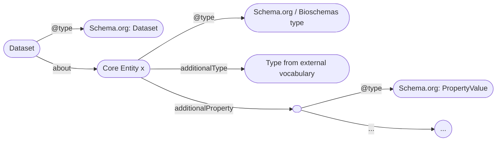
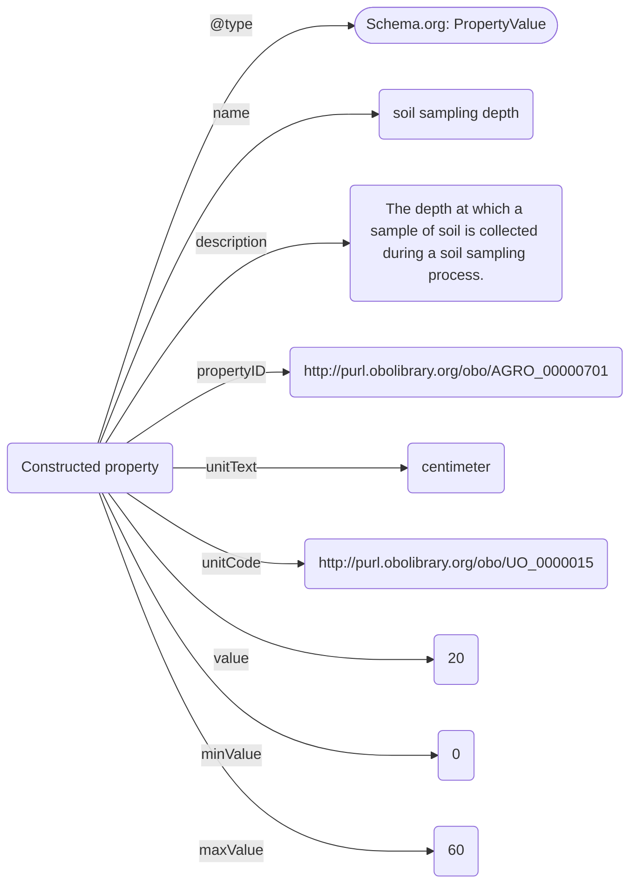

Draft version; 11.12.2025

# Overview
Agrischemas is a framework building on Schema.org and [Bioschemas](https://bioschemas.org/) to add agricultural related information to [Dataset](https://schema.org/Dataset) metadata with a focus on increasing its findability. It uses existing [types](https://bioschemas.org/types/) and [properties](https://schema.org/Property) and recommends semantic concepts to achieve interoperability. It can be implemented in already existing Schema.org interfaces by mapping domain-specific information available in local data/metadata to structures described in this document. **Agrischemas offers a list of recommended types and properties for findability based on this approach.**

One of Agrischemas' possible use-cases is the harmonization of metadata of different Research Data Infrastructures (RDIs) participating in the [FAIRagro consortium](https://fairagro.net/) to power its central [FAIRagro Search Hub](https://search-hub.fairagro.net/).

This document explains the concepts of the Agrischemas framework, its core entities, a set of recommended properties enriched with semantic concepts for each of them.

# Design principles and modeling conventions
Agrischemas aims at efficiently reusing established resources, only extending these where necessary. In general, the framework builds on following modeling conventions:
- Agrischemas uses a set of existing Schema.org / [Bioschemas](https://bioschemas.org/types/) types to represent its core entities. The corresponding type for each core entity is listed in its chapter. Instances of the core entities are typed via the "@type" property.
- Instances of the core entities are linked to [Dataset](https://schema.org/Dataset) via the [about](https://schema.org/about) property.
- For semantic enrichment, instances of the core entities are further typed via the [additionalType](https://schema.org/additionalType) property, referencing specific semantic concepts.
- Agrischemas makes use of the [additionalProperty](https://schema.org/additionalProperty) property in combination with the [PropertyValue](https://schema.org/PropertyValue) type to construct properties increasing the findability of datasets.
- By using the [propertyID](https://schema.org/propertyID) property, these constructed properties are semantically enriched.
- Where possible Agrischemas recommends the use of controlled vocabularies/terminologies for values of properties.
- If the value of a property is more complex than a string, Agrischemas uses the [valueReference](https://schema.org/valueReference) to provide a link to a semantic concept for the value.

An example metadata instance in Agrischemas could look like this:

**Figure 1:** General structure of domain specific metadata in a Dataset metadata instance in Agrischemas

- For each property constructed via [additionalProperty](https://schema.org/additionalProperty), following properties are possibily used, to define it:
	- [name](https://schema.org/name): The name of the property.
	- [description](https://schema.org/description): A description or definition of the property. This can be cited from terminologies or other semantic resources.
	- [propertyID](https://schema.org/propertyID): A reference to a semantic concept, e.g. a terminology class or property, that represents the property.
	- [unitText](https://schema.org/unitText): The unit a property is measured in as a string.
	- [unitCode](https://schema.org/unitCode): A reference to a semantic concept that represents the unit a property is measured in.
	- [value](https://schema.org/value): The value of a specific measurement of a property.
	- [minValue](https://schema.org/minValue): The minimum possible value of a specific measurement of a property.
	- [maxValue](https://schema.org/maxValue): The maximum possible value of a specific measurement of a property.
	- [valueReference](https://schema.org/valueReference): A secondary value that provides additional information on the original value, e.g. a reference temperature or a type of measurement.


**Figure 2:** Soil sampling depth as an example of a constructed property.

# Crop
- **Definition:** Plants cultivated for food, fiber, livestock fodder or other uses, usually sown and harvested during a single agricultural year.
	- [Definition source](http://aims.fao.org/aos/agrovoc/c_1972)
- **Type:** [BioSample](https://bioschemas.org/BioSample)
- **Additional type:** http://purl.obolibrary.org/obo/AGRO_00000325

A crop entity represents a sample of a specific plant or group of plants, sharing the same [taxonomic species](http://aims.fao.org/aos/agrovoc/c_331243), that are described in a dataset.

Agrischemas recommends the following set of constructed properties to describe a crop:
|ID|name| description |propertyID|unitText|unitCode|minValue|maxValue|Controlled vocabulary
|--|--|--|--|--|--|--|--|--|
|CR_001|species|A group of organisms of common ancestry having common characteristics, that are able to reproduce only among themselves to produce fertile offspring and which are usually geographically distinct. It constitutes the fundamental rank in the taxonomic hierarchy.|http://aims.fao.org/aos/agrovoc/c_331243|/|/|/|/|AGROVOC concepts with the "has taxonomic rank" property with a value of [species](https://agrovoc.fao.org/browse/agrovoc/en/page/c_331243)
|CR_002|variety|A plant grouping, within a single botanical taxon of the lowest known rank, defined by the reproducible expression of its distinguishing and other genetic characteristics. A formal rank in botanical taxonomic nomenclature|http://aims.fao.org/aos/agrovoc/c_1423211760123|/|/|/|/|/
|CR_003|sowing date|Date of sowing.|http://aims.fao.org/aos/agrovoc/c_16208|Date|https://schema.org/Date|/|/|/
|CR_004|harvesting date|Date of harvest.|http://aims.fao.org/aos/agrovoc/c_29464|Date|https://schema.org/Date|/|/|/

For expressing pheontypic traits, we recommend using traits from the [Crop Ontology](https://cropontology.org/). It collects traits for different species in separate ontologies. Please refer to the specific ontology relevant for the species you are describing and express each trait in the following structure:
```
{
  "@context": "https://bioschemas.org/",
  "@type": "Biosample",
  "additionalType": "http://aims.fao.org/aos/agrovoc/c_5993",
  "additionalProperty": [
    {
      "@type": "PropertyValue",
      "name": "Plant height",
      "propertyID": "https://cropontology.org/rdf/CO_321:0000020",
      "description": "Height of plant from ground to top of spike, excluding awns."
      "value":"110"
      "unitText":"centimeter",
      "unitCode":"http://purl.obolibrary.org/obo/UO_0000015"
    }
  ]
}				
```

# Soil

- **Definition:** Upper layer of the earth in which plants grow.
	- [Definition source](http://aims.fao.org/aos/agrovoc/c_7156)
- **Type:** [Sample](https://bioschemas.org/Sample)
- **Additional type:** http://aims.fao.org/aos/agrovoc/c_7156

A soil entity represents a specific soil sample, that is described in a dataset, representative for a bigger unit of land.

Agrischemas recommends the following set of constructed properties to describe a soil sample:
|ID|name| description |propertyID|unitText|unitCode|minValue|maxValue|Controlled vocabulary
|--|--|--|--|--|--|--|--|--|
|SO_001|soil texture|Soil texture (such as loam, sandy loam or clay) refers to the proportion of sand, silt and clay sized particles that make up the mineral fraction of the soil.|http://aims.fao.org/aos/agrovoc/c_7199|/|/|/|/|For USDA soil classification classes, use the following classes: [clay](https://lod.nal.usda.gov/nalt/26755), [silty clay](https://lod.nal.usda.gov/nalt/105830),[sandy clay](https://lod.nal.usda.gov/nalt/105829), [clay loam](https://lod.nal.usda.gov/nalt/26741), [silty clay loam](https://lod.nal.usda.gov/nalt/286875), [sandy clay loam](https://lod.nal.usda.gov/nalt/105828), [loam](https://lod.nal.usda.gov/nalt/50479), [silt loam](https://lod.nal.usda.gov/nalt/63100), [silt](https://lod.nal.usda.gov/nalt/63101), [sandy loam](https://lod.nal.usda.gov/nalt/62359), [loamy sand](https://lod.nal.usda.gov/nalt/105831), [sand](https://lod.nal.usda.gov/nalt/62360)
|SO_002|reference group|The World Reference Base (WRB) is an international system for classification of soils. It was designed to cater for any soil in the world. WRB has come forth from an initiative of FAO and UNESCO, supported by UNEP and the International Union of Soil Sciences (IUSS).|http://aims.fao.org/aos/agrovoc/c_89f35c33|/|/|/|/|Use subclasses of the AGROVOC ["World Reference Base soil types"](http://aims.fao.org/aos/agrovoc/c_89f35c33) class 
|SO_003|pH|Soil pH is a measure of the acidity or alkalinity of the soil. A pH value is actually a measure of hydrogen ion concentration. It is a ‘reverse’ scale in that a very acid soil has a low pH and a high hydrogen ion concentration.|http://aims.fao.org/aos/agrovoc/c_34901|/|http://purl.obolibrary.org/obo/UO_0000196|0|14|/
|SO_004|bulk density|A sufficiently large volume of soil containing a large number of pores, such that the concept of mean global properties is applicable.|http://aims.fao.org/aos/agrovoc/c_7167|g/cm3|http://purl.obolibrary.org/obo/UO_0000084|/|/|/
|SO_005|sampling depth|The depth at which a sample of soil is collected during a soil sampling process.|http://purl.obolibrary.org/obo/AGRO_00000701|centimeter|http://purl.obolibrary.org/obo/UO_0000015|/|/|/
|SO_006|available water content|Quantity of water present in the soil and usable by plants, classically defined as the difference between moisture at field capacity and moisture at wilting point.|http://opendata.inrae.fr/thesaurusINRAE/c_6446|milimeter|http://purl.obolibrary.org/obo/UO_0000016|/|/|/
|SO_007|organic carbon|Soil organic carbon (SOC) refers to the carbon held within the soil and is expressed as a percentage by weight (gC/Kg soil). Climatic shifts in temperature and precipitation have a major influence on the decomposition and amount of SOC stored within an ecosystem and that released into the atmosphere. Globally, the amount of carbon stored in soils is twice the amount that is stored in all terrestrial plants. Soil organic carbon (SOC) is essential for maintaining fertility, water retention, and plant production in terrestrial ecosystems. The amount of SOC stored within an ecosystem, is dependent on the quantity and quality of organic matter returned to the soil matrix, the soils ability to retain organic carbon (a function of texture and caption exchange capacity), and biotic influences of both temperature and precipitation. The global decline in SOC as a result of deforestation, shifting cultivation and arable cropping have made significant contributions to increased levels of atmospheric carbon dioxide (CO2).|http://aims.fao.org/aos/agrovoc/c_389fe908|gC/Kg|/|/|/|/
|SO_008|total carbon|Content or amount of total carbon in soil, including organic carbon and carbon from lime.|http://aims.fao.org/aos/agrovoc/c_24fb4269|/|/|/|/|
|SO_009|total nitrogen|Content or amount of total nitrogen in soil.|http://aims.fao.org/aos/agrovoc/c_bdc779f4|/|/|/|/|/

If you want to represent additional soil properties, we recommend using subclasses of the AGROVOC [soil properties](http://aims.fao.org/aos/agrovoc/c_330883) concept.

# Plot
- **Definition:** An area of land, somehow related to a dataset, with a particular ownership, land use, or other characteristic.
	 - [Definition source](http://aims.fao.org/aos/agrovoc/c_fdfbb37f) 
- **Type:** [Place](https://schema.org/Place)
-  **Additional type:** http://aims.fao.org/aos/agrovoc/c_2894

A plot entity represents a single plot that is somehow related to a dataset.

The following, existing properties are recommended to describe a plot:
|Property|Expected type|Description|Cardinality|Controlled Vocabulary|
|--|--|--|--|--|
|name|[Text](https://schema.org/Text)|The name of the place.|MANY|/
|geo|[GeoShape](https://schema.org/GeoShape)|The geo coordinates of the place.|MANY|/

- For **geo**: The geographical coordinates of a [Place](https://schema.org/Place) should be attached to it through a [GeoShape](https://schema.org/GeoShape) object by using the geo property. The [GeoShape](https://schema.org/GeoShape) type offers the [box](https://schema.org/box) property to attach a bounding box as a [Text](https://schema.org/Text) where the box is expressed as two points separated by a space character. The first point is the lower corner, the second point is the upper corner.

|ID|name| description |propertyID|unitText|unitCode|minValue|maxValue|Controlled vocabulary
|--|--|--|--|--|--|--|--|--|
|PL_001|crop yield|The amount of plant crop (such as cereal, grain or legume) harvested per unit area for a given time.|http://aims.fao.org/aos/agrovoc/c_10176|dt/ha|/|/|/|/
|PL_002|elevation|Altitude, like elevation, is the distance above sea level.|http://aims.fao.org/aos/agrovoc/c_316|meter|http://purl.obolibrary.org/obo/UO_0000008|/|/|/
|PL_003|plot size|The size of a specific plot measured in m².|http://aims.fao.org/aos/agrovoc/c_2893|square meter|http://purl.obolibrary.org/obo/UO_0000080|/|/|/
|PL_004|spatial reference system|A spatial reference system (SRS) or coordinate reference system (CRS) is a framework used to precisely measure locations on the surface of Earth as coordinates.|https://www.commoncoreontologies.org/ont00000275|/|/|/|/|Please use [ESPG codes](https://epsg.io/), e.g. "EPSG:4326" for WGS 84, where possible 

# Sensor
 - **Definition**: A device, somehow related to a dataset, that observes and measures a physical property of a natural phenomenon or man-made process and converts that measurement into a signal (chemical, electrical or other).
	 - [Definition source](http://aims.fao.org/aos/agrovoc/c_28279)
 - **Type:**[Product](https://schema.org/Product)
 - **Additional type:** [Sensor](http://www.w3.org/ns/sosa/Sensor)

A sensor entity represents a specific sensor, that is described in a dataset, or was used to create measurements in it.

The following, existing properties are recommended to describe a sensor:
|ID|name| description |propertyID|unitText|unitCode|minValue|maxValue|Controlled vocabulary
|--|--|--|--|--|--|--|--|--|
|SE_001|is hosted by|Relation between a Sensor and the Platform that it is mounted on or hosted by.|https://www.w3.org/TR/vocab-ssn/#SOSAisHostedBy|/|/|/|/|
|SE_002|activity type|Describes if the sensor is an active or a passive sensor.|/|/|/|/|/|"Active" or "Passive"
|SE_003|sensor type|Describes what type of information the sensor measures.|/|/|/|/|/|<ul><li>[Radar](http://aims.fao.org/aos/agrovoc/c_24071)</li><li>[LiDAR](http://aims.fao.org/aos/agrovoc/c_c3ea7f1d)</li><li>[Optical sensor](http://aims.fao.org/aos/agrovoc/c_08dded27)</li><li>[Thermal Infrared Sensor](http://opendata.inrae.fr/thesaurusINRAE/c_17410)</li><li>Atmospheric sounder</li></ul>
|SE_004|band category|Describes if a sensor uses single, multi or hyper spectral bands.|/|/|/|/|/|<ul><li>single-band</li><li>multi-band</li><li>hyper-spectral</li><li> broadband</li></ul>
|SE_004|spectral band|Describes a specific spectral band of a sensor|/|/|/|/|/|/


# Agricultural process
*WIP*
- **Definition**: A planned process which occurs in an agricultural field.
	- [Definition source](http://purl.obolibrary.org/obo/AGRO_00002071)
 - **Type:** [LabProcess](https://bioschemas.org/LabProcess)
 - **Additional type:** [Agricultural process](http://purl.obolibrary.org/obo/AGRO_00002071)

An agricultural process entity represents a specific agricultural process, that is described in a dataset, or was used was part of its creation.

To express an agricultural process, please create a  [LabProcess](https://bioschemas.org/LabProcess) object in the metadata instance and attach it to a [Dataset](https://schema.org/) object via the https://schema.org/about property. This describes a single execution of the process.
To describe the protocol that the process follows, please use the [LabProtocol](https://bioschemas.org/LabProtocol) type and attach it to a process via the [executesLabProtocol](https://bioschemas.org/types/LabProcess/0.1-DRAFT#executesLabProtocol) property. Link the [LabProtocol](https://bioschemas.org/LabProtocol) object to one of the recommended resources from this specificiation via the [intendedUse](https://bioschemas.org/types/LabProtocol/0.5-DRAFT#intendedUse) property:

Here you can find an example of the described structure:
```
{
  "@context": "https://schema.org/",
  "@type": "Dataset",
  "about": [
    {
      "@context": "https://bioschemas.org/",
      "@type": "LabProcess",
      "additionalType":"http://purl.obolibrary.org/obo/AGRO_00002071",
      "executesLabProtocol":
	      {
		      "@type": "LabProtocol",
		      "intendedUse":"http://purl.obolibrary.org/obo/AGRO_00020004"
		  }
    }
  ]
}
```
Use one of the following recommendations as a value for the intendedUse property, if you want to express one of the following standard agricultural processes:


|Process|References|
|--|--|
|Irrigation|<ul><li>For general irrigation processes please use http://purl.obolibrary.org/obo/AGRO_00000006</li><li>For more specific types of irrigation, please use one of its respective sub classes.</li></ul>|
|Tillage| <ul><li>For general tillage processes please use http://purl.obolibrary.org/obo/AGRO_01000015</li><li>For more specific types of tillage, please use one of its respective sub classes.</li></ul>|
|Pest control|<ul><li>For general pest control processes please use http://purl.obolibrary.org/obo/AGRO_00000023</li><li>For more specific types of pest control please its respective sub classes.</li></ul>
|Fertilizer application |<ul><li>For fertilizer application processes please use http://purl.obolibrary.org/obo/AGRO_01000000.</li></ul>

# Feedback
If you would like to provide feedback to Agrischemas, e.g. for proposing new core entities, new properties important for findability,  on definitions in the specification or to recommend additional semantic concepts for values, please use one of the following templates to create an issue in our Github repository. 
- Template core entity
- Template new property
- Template definitions 
- Template semantic concept values

 Issues will be discussed in the Agrischemas Working Group. If you are interested in joining the group, please contact its [mailinglist](mailto:agri-wg-bioschemas@listserv.dfn.de). 
