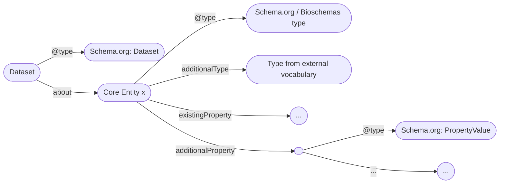
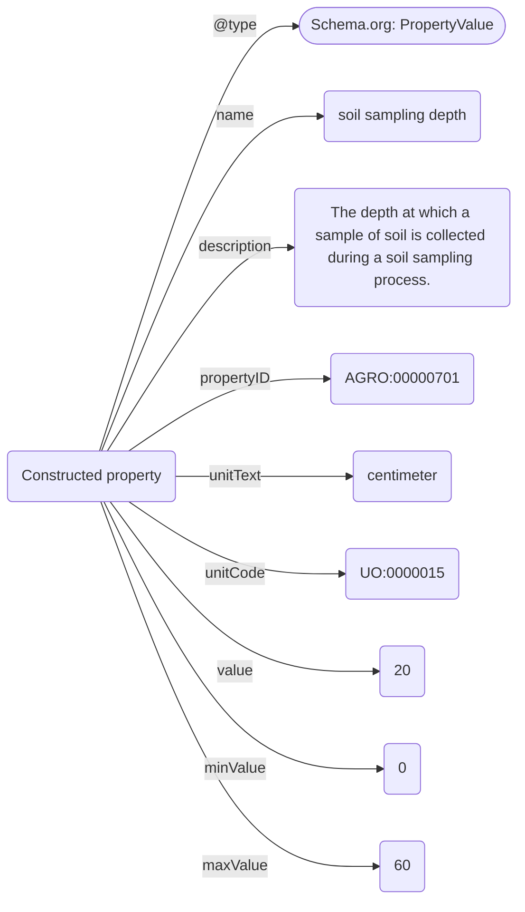

Draft version; 10.09.2025
# Overview
```
To-Do: 
- What are the benefits of adopting Agrischemas?
	- Showcase FAIRagro Search Hub queries
	- Showcase mapping/interoperability possibilities
	- ?
	- What to do with properties that have different units in a metadata instance than in the linked propertyID (e.g. plant height)
	- 
```
Agrischemas is a framework building on Schema.org and [Bioschemas](https://bioschemas.org/) to add agricultural related information to [Dataset](https://schema.org/Dataset) metadata with a focus on increasing its findability. It uses existing [types](https://bioschemas.org/types/), [properties](https://schema.org/Property) and [profiles](https://bioschemas.org/profiles/) and recommends semantic concepts to achieve interoperability.
One of Agrischemas' possible use-cases is the harmonization of metadata of different Research Data Infrastructures (RDIs) participating in the [FAIRagro consortium](https://fairagro.net/) to power its central [FAIRagro Search Hub](https://search-hub.fairagro.net/).
This tutorial explains the concepts of the Agrischemas framework, its core entities, a set of recommended properties and their semantic concepts and basic implementation guidance for RDIs that want to adopt it.

# Core entities and their Schema.org / Bioschemas types
```
To-Do: 
	- Agree on definitions of core entities
		- Plot --> Adapted from http://aims.fao.org/aos/agrovoc/c_fdfbb37f
		- Sensor --> Adapted from http://aims.fao.org/aos/agrovoc/c_28279 
	- ?MedicalCondition?
	- ?ChemicalSubstance?
```
Agrischemas uses a set of existing Schema.org / Bioschemas types to represent its core entities:
	- Crop: A cultivated plant that is somehow related to a dataset.; uses [BioSample](https://bioschemas.org/BioSample).
	- Soil: A soil sample that is somehow related to a dataset.; uses [Sample](https://bioschemas.org/Sample).
	- Plot: An area of land, somehow related to a dataset, with a particular ownership, land use, or other characteristic.; uses [Place](https://schema.org/Place).
	- Sensor: A device, somehow related to a dataset, that observes and measures a physical property of a natural phenomenon or man-made process and converts that measurement into a signal (chemical, electrical or other).; uses [Product](https://schema.org/Product).

# Design principles and modeling conventions
```
To-Do:
- Also include less granular approach using https://schema.org/variableMeasured?
- Add explanation on how to model more granular value shapes
```
Agrischemas aims at efficiently reusing established resources, only extending these where necessary. In general, the framework builds on following modeling conventions:
- Instances of the core entities are linked to [Dataset](https://schema.org/Dataset) via the [about](https://schema.org/about) property.
- Instances of the core entities are typed via "@type" to the Schema.org / Bioschemas types described in the previous chapter.
- For semantic enrichment, instances of the core entities are further typed via the [additionalType](https://schema.org/additionalType) property, referencing specific semantic concepts.
- Where possible, existing and well defined properties of reused types are prefered.
- If a required property doesn't exist in Schema.org / Bioschemas, Agrischemas makes use of the [additionalProperty](https://schema.org/additionalProperty) property in combination with the [PropertyValue](https://schema.org/PropertyValue) type to construct it. **Agrischemas offers a list of recommended properties for findability based on this approach.**

An example metadata instance in Agrischemas could look like this:

**Figure 1:** General structure of domain specific metadata in a Dataset metadata instance in Agrischemas

- For each property constructed via [additionalProperty](https://schema.org/additionalProperty), following properties are used, to define it.:
	- [name](https://schema.org/name): The name of the property.
	- [description](https://schema.org/description): A description or definition of the property. This can be cited from terminologies or other semantic resources.
	- [propertyID](https://schema.org/propertyID): A reference to a semantic concept, e.g. a terminology class or property, that represents the property.
	- [unitText](https://schema.org/unitText): The unit a property is measured in as a string.
	- [unitCode](https://schema.org/unitCode): A reference to a semantic concept that represents the unit a property is measured in.
	- [value](https://schema.org/value): The value of a specific measurement of a property.
	- [minValue](https://schema.org/minValue): The minimum possible value of a specific measurement of a property.
	- [maxValue](https://schema.org/maxValue): The maximum possible value of a specific measurement of a property.


**Figure 2:** Soil sampling depth as an example of a constructed property.

# Crop
```
To-Do:
- define controlled vocabularies for existing and constructed properties
	- List of plant sample collection methods
	- List of varieties
```
Type: [BioSample](https://bioschemas.org/BioSample)
AdditionalType: http://purl.obolibrary.org/obo/AGRO_00000325

A crop entity represents a sample of a specific plant or group of plants, sharing the same [taxonomic species](http://aims.fao.org/aos/agrovoc/c_331243), that are described in a dataset.
The following, existing properties are recommended to describe a crop:

|Property|Expected type|Description|Cardinality|Controlled Vocabulary|
|--|--|--|--|--|
|taxonomicRange|[DefinedTerm](http://schema.org/DefinedTerm) or [Taxon](https://bioschemas.org/types/drafts/Taxon) or [Text](http://schema.org/Text) or [URL](http://schema.org/URL)|The taxonomic grouping of the organism that expresses, encodes, or in someway related to the BioChemEntity.|ONE|All plant terms with a taxonomic rank of species (https://agrovoc.fao.org/browse/agrovoc/en/page/c_331243) in AGROVOC|
|collectionMethod|[Text](http://schema.org/Text)|Provide information about the conditions and methods of acquisition of crop (samples).|MANY|
|locationOfOrigin|[GeoCoordinates](https://schema.org/GeoCoordinates) or [Place](https://schema.org/Place) or [Text](http://schema.org/Text)|The location from which the crop (sample) was originally collected.|ONE|
|dateCreated|[Date](https://schema.org/Date) or [DateTime](https://schema.org/DateTime)|The date the crop sample was created.|ONE|

- Usage advice:
	- For **taxonomicRange**: In Agrischemas' context the property is meant to express the taxonomic membership of a crop on a species level. Possible levels of modeling granularity are possible:
		- Text: Expression of a species name as a string (e.g. "Triticum aestivum"). This is not preferred, as the free text is prone to error and does not offer benefits interoperability wise.
		- URL: Reference ot a resource describing a species (e.g. "http://aims.fao.org/aos/agrovoc/c_7951"). This is preferred to free text, as it offers additional information, depending on the referenced source, that applications consuming the metadata can use. (**recommended**)
		- Taxon: Reference to an instance of the Bioschemas [Taxon](https://bioschemas.org/types/Taxon/1.0-RELEASE) type. The type offers additional properties to describe a specific taxon, making more detailed information directly in the same metadata instance. (**recommended**)
		- DefinedTerm: Reference to an instance of the Schema.org [DefinedTerm](https://schema.org/DefinedTerm) type. This option is similiar to the Taxon option, but not as semantically explicit. If DefinedTerm is already used for creating metadata instances, it might be beneficial to choose this option.
	- For **collectionMethod**: If possible, use a term from a controlled vocabulary here to increase interoperability.
	- For **locationOfOrigin**: If the location of origin of a crop is one of the plots described in the same metadata instance, it is recommended to reference this plot entity here.


Beside these existing properties, Agrischemas recommends the following set of constructed properties to describe a crop:
|ID|name| description |propertyID|unitText|unitCode|minValue|maxValue|Controlled vocabulary
|--|--|--|--|--|--|--|--|--|
|CR_001|variety|A plant grouping, within a single botanical taxon of the lowest known rank, defined by the reproducible expression of its distinguishing and other genetic characteristics. A formal rank in botanical taxonomic nomenclature|http://aims.fao.org/aos/agrovoc/c_1423211760123|Text or URL|https://schema.org/Text or https://schema.org/URL|/|/|
|CR_002|developmental stage|Distinct phase within a crops lifecycle.|http://aims.fao.org/aos/agrovoc/c_5959|Text or URL|https://schema.org/Text or https://schema.org/URL|/|/|Terms from the [BBCH-based Plant Phenological Description Ontology](https://agroportal.lirmm.fr/ontologies/PPDO)
|CR_003|sowing date|Date of sowing.|http://aims.fao.org/aos/agrovoc/c_16208|Date|https://schema.org/Date|/|/|
|CR_004|heading date| Heading date (HD) - days to heading from first January in a given year|/|day|http://purl.obolibrary.org/obo/UO_0000033|/|/|
|CR_005|harvesting date|Date of harvest.|http://aims.fao.org/aos/agrovoc/c_29464|Date|https://schema.org/Date|/|/|
|CR_006|plant height|Plant height (PH) - average plant height pre-harvest|http://aims.fao.org/aos/agrovoc/c_61f3cae5|centimeter|http://purl.obolibrary.org/obo/UO_0000015|||
|CR_007|seed weight|Weight of a seed.|http://aims.fao.org/aos/agrovoc/c_36510|gram|http://purl.obolibrary.org/obo/UO_0000021|/|/|
|CR_008|grain weight|A caryopsis fruit morphology trait (TO:0001079) which is the weight of a caryopsis fruit (grain or kernel; PO:0030104).|http://purl.obolibrary.org/obo/TO_0000919|kg/hL|/|/|/
|CR_009|grain hardiness|Grain hardiness, reflecting a plants ability to survive harsh conditions in percent.|http://aims.fao.org/aos/agrovoc/c_11458|percent|http://purl.obolibrary.org/obo/UO_0000187|/|/|
|CR_010|protein content|Protein content (PC) were measured using NIR grain analyzer.|http://aims.fao.org/aos/agrovoc/c_6251|percent|http://purl.obolibrary.org/obo/UO_0000187|/|/|

- Usage advice:
	- For the developmental stage property you can use the [BBCH-based Plant Phenological Description Ontology](https://agroportal.lirmm.fr/ontologies/PPDO). Do so, by using the URI of a growth stage as the value of the developmental stage property.

# Soil
```
- To-Do:
	- Add explanation on how to reference plot object in the same metadata instance
	- List of soil sample collection methods
	- Use classification for soil textures
	- Use classification for soil reference groups
	- Use classification for soil pH values

```
Type: [Sample](https://bioschemas.org/Sample)
AdditionalType: http://aims.fao.org/aos/agrovoc/c_7156
A soil entity represents a speficic soil sample, that is described in a dataset, representative for a bigger unit of land.

The following, existing properties are recommended to describe a soil:
|Property|Expected type|Description|Cardinality|Controlled Vocabulary|
|--|--|--|--|--|
|collectionMethod|[Text](http://schema.org/Text)|Provide information about the conditions and methods of acquisition of soil (samples).|MANY|
|locationOfOrigin|[GeoCoordinates](https://schema.org/GeoCoordinates) or [Place](https://schema.org/Place) or [Text](http://schema.org/Text)|The location from which the soil (sample) was originally collected.|ONE|
|dateCreated|[Date](https://schema.org/Date) or [DateTime](https://schema.org/DateTime)|The date the soil sample was created.|ONE|


- Usage advice:
- - For **collectionMethod**: If possible, use a term from a controlled vocabulary here to increase interoperability.
	- For **locationOfOrigin**: If the location of origin of a soil is one of the plots described in the same metadata instance, it is recommended to reference this plot entity here.

Beside these existing properties, Agrischemas recommends the following set of constructed properties to describe a soil:
|ID|name| description |propertyID|unitText|unitCode|minValue|maxValue|Controlled vocabulary
|--|--|--|--|--|--|--|--|--|
|SO_001|soil texture|Soil texture (such as loam, sandy loam or clay) refers to the proportion of sand, silt and clay sized particles that make up the mineral fraction of the soil.|http://aims.fao.org/aos/agrovoc/c_7698|/|/|/|/
|SO_002|reference group|The World Reference Base (WRB) is an international system for classification of soils. It was designed to cater for any soil in the world. WRB has come forth from an initiative of FAO and UNESCO, supported by UNEP and the International Union of Soil Sciences (IUSS).|http://aims.fao.org/aos/agrovoc/c_89f35c33|/|/|/|/|
|SO_003|pH|Soil pH is a measure of the acidity or alkalinity of the soil. A pH value is actually a measure of hydrogen ion concentration. It is a ‘reverse’ scale in that a very acid soil has a low pH and a high hydrogen ion concentration.|http://aims.fao.org/aos/agrovoc/c_34901|/|http://purl.obolibrary.org/obo/UO_0000196|0|14|
|SO_004|bulk density|A sufficiently large volume of soil containing a large number of pores, such that the concept of mean global properties is applicable.|http://aims.fao.org/aos/agrovoc/c_7167|g/cm3|http://purl.obolibrary.org/obo/UO_0000084|/|/|
|SO_005|sampling depth|The depth at which a sample of soil is collected during a soil sampling process.|http://purl.obolibrary.org/obo/AGRO_00000701|centimeter|http://purl.obolibrary.org/obo/UO_0000015|/|/|
|SO_006|available water content|Quantity of water present in the soil and usable by plants, classically defined as the difference between moisture at field capacity and moisture at wilting point.|http://opendata.inrae.fr/thesaurusINRAE/c_6446|milimeter|http://purl.obolibrary.org/obo/UO_0000016|/|/|
|SO_007|organic carbon|Soil organic carbon (SOC) refers to the carbon held within the soil and is expressed as a percentage by weight (gC/Kg soil). Climatic shifts in temperature and precipitation have a major influence on the decomposition and amount of SOC stored within an ecosystem and that released into the atmosphere. Globally, the amount of carbon stored in soils is twice the amount that is stored in all terrestrial plants. Soil organic carbon (SOC) is essential for maintaining fertility, water retention, and plant production in terrestrial ecosystems. The amount of SOC stored within an ecosystem, is dependent on the quantity and quality of organic matter returned to the soil matrix, the soils ability to retain organic carbon (a function of texture and caption exchange capacity), and biotic influences of both temperature and precipitation. The global decline in SOC as a result of deforestation, shifting cultivation and arable cropping have made significant contributions to increased levels of atmospheric carbon dioxide (CO2).|http://aims.fao.org/aos/agrovoc/c_389fe908|gC/Kg|/|/|/|
|SO_008|total carbon|Content or amount of total carbon in soil, including organic carbon and carbon from lime.|http://aims.fao.org/aos/agrovoc/c_24fb4269|/|/|/|/|
|SO_009|total nitrogen|Content or amount of total nitrogen in soil.|http://aims.fao.org/aos/agrovoc/c_bdc779f4|/|/|/|/|


# Plot
```
- To-Do:
	- Add URIs/Codes for most common geo reference systems to the explanation
```

Type: [Place](https://schema.org/Place)
AdditionalType: http://aims.fao.org/aos/agrovoc/c_2894
A plot of land is an area of land with a particular ownership, land use, or other characteristic. A plot is frequently used as the basis for a cadastre or land registration system.

The following, existing properties are recommended to describe a plot:
|Property|Expected type|Description|Cardinality|Controlled Vocabulary|
|--|--|--|--|--|
|name|[Text](https://schema.org/Text)|The name of the place.|MANY|
|geo|[GeoShape](https://schema.org/GeoShape)|The geo coordinates of the place.|MANY|

- Usage advice:
	- For **geo**: The geographical coordinates of a [Place](https://schema.org/Place) should be attached to it through a [GeoShape](https://schema.org/GeoShape) object by using the geo property. The GeoShape](https://schema.org/GeoShape) type offers the [box](https://schema.org/box) property to attach a bounding box as a [Text](https://schema.org/Text) where the box is expressed as two points separated by a space character. The first point is the lower corner, the second point is the upper corner.

|ID|name| description |propertyID|unitText|unitCode|minValue|maxValue|Controlled vocabulary
|--|--|--|--|--|--|--|--|--|
|PL_001|crop yield|The amount of plant crop (such as cereal, grain or legume) harvested per unit area for a given time.|http://aims.fao.org/aos/agrovoc/c_10176|dt/ha|/|/|/|
|PL_002|elevation|Altitude, like elevation, is the distance above sea level.|http://aims.fao.org/aos/agrovoc/c_316|meter|http://purl.obolibrary.org/obo/UO_0000008|/|/|
|PL_003|plot size|The size of a specific plot measured in m².|http://aims.fao.org/aos/agrovoc/c_2893|square meter|http://purl.obolibrary.org/obo/UO_0000080|/|/|
|PL_004|spatial reference system|A spatial reference system (SRS) or coordinate reference system (CRS) is a framework used to precisely measure locations on the surface of Earth as coordinates.|https://www.commoncoreontologies.org/ont00000275|/|/|/|/|
|PL_005|spatial resolution|The distance between independent geo measurements.|/|/|/|/|/|

- Usage advice:
	- For the spatial reference system property, please use EPSG codes (e.g. "EPSG:4326" for WGS 84) where possible. 


# Sensor
**WIP**
```
- To-Do:
	- Find/create list of common sensor platforms (satelite, plane, UAV, etc.)
	- Find/create list of common sensor types
	- Find/create list of band categories
	- Find/create list of spectral bands
```
Type: [Product](https://schema.org/Product)
AdditionalType: [Sensor](http://www.w3.org/ns/sosa/Sensor)

A sensor entity represents a specific sensor, that is described in a dataset, or was used to create measurements in it.
The following, existing properties are recommended to describe a sensor:

The following, existing properties are recommended to describe a sensor:
|Property|Expected type|Description|Cardinality|Controlled Vocabulary|
|--|--|--|--|--|
|[manufacturer](https://schema.org/manufacturer "manufacturer")|[Organization](https://schema.org/Organization)|The manufacturer of the sensor.|MANY|
|[model](https://schema.org/model "model")|[ProductModel](https://schema.org/ProductModel "ProductModel") or [Text](https://schema.org/Text "Text")|The model of the sensor.|ONE|
|[releaseDate](https://schema.org/releaseDate "releaseDate")|[Date](https://schema.org/Date)|The release date of a sensor or sensor model.|ONE|
|[productID](https://schema.org/productID "productID")|[Text](https://schema.org/Text)|The product identifier of the sensor.|MANY|
|[description](https://schema.org/description "description")|[Text](https://schema.org/Text "Text") or [TextObject](https://schema.org/TextObject "TextObject")|A textual description of the sensor.|MANY|

- Usage advice:
	- for **manufacturer**, please provide at least a name by attaching it to the [Organization](https://schema.org/Organization) object via the [name](https://schema.org/name) property
	- for **model**, please provide at least a name by representing the value as a [Text](https://schema.org/Text "Text"). If additional information is needed, a [ProductModel](https://schema.org/ProductModel "ProductModel") object can be attached.


|ID|name| description |propertyID|unitText|unitCode|minValue|maxValue|Controlled vocabulary
|--|--|--|--|--|--|--|--|--|
|SE_001|is hosted by|Relation between a Sensor and the Platform that it is mounted on or hosted by.|https://www.w3.org/TR/vocab-ssn/#SOSAisHostedBy|/|/|/|/|
|SE_002|activity type|Describes if the sensor is an active or a passive sensor.|?|/|/|/|/|
|SE_003|sensor type|Describes what type of information the sensor measures.|?|/|/|/|/|
|SE_004|band category|Describes if a sensor uses single, multi or hyper spectral bands.|?|/|/|/|/|
|SE_004|spectral band|Describes a specific spectral band of a sensor|?|/|/|/|/|

# Implementation guidance
```
To-Do:
- Write generic step by step guide for RDIs on how to map their local metadata schemas to Agrischemas 
```

## Validation mechanisms
```
To-Do:
- Develop SHACL shapes and reference them here for validation?
```
